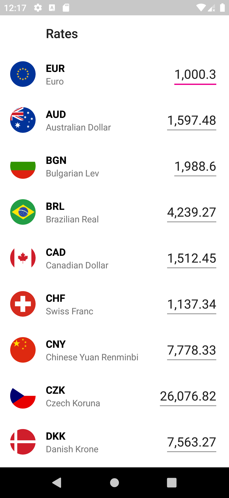
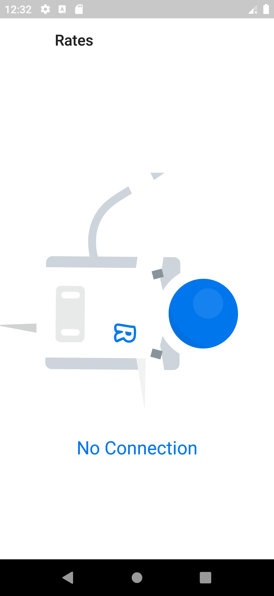

## Revolut Currencies - Novemio Demo

  

## Task

* List all currencies you get from the endpoint (one per row).
* Each row has an input where you can enter any amount of money. 
* When you tap on a currency row it should slide to the top and it's input becomes the first responder.
* When you’re changing the amount the app must simultaneously update the corresponding value for other currencies.

## What describes this code

* Clean architecture
* Deserialization data 
* Repository pattern
* MVVM pattern for presentation layer
* Data binding
* Observable pattern
* Unit tests ( MockK )
* CI/CD 
* Firebase distribution ( The latest version ) : https://appdistribution.firebase.dev/i/n5BMzw6m  
* Bitrise integration :   
* Network handling 
* Performance
* Kotlin DSL
